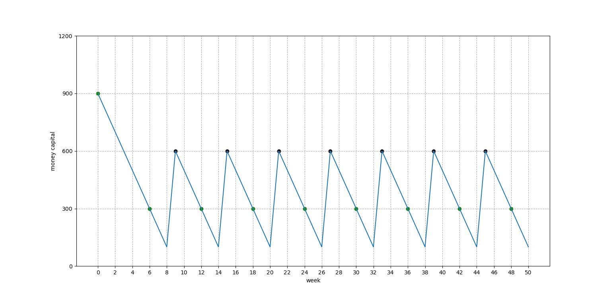

通过我独立的研究，发现，在这个模型里面，除了第一次的投资的期初货币资本额比如说是1200之外，其他的一些关键节点上，存在的货币资本额比如说只有：900（或0），300。

2022-04-06 19:00

---

完善了马克思连续再生产理论之可视化，使周数的坐标更加方便。横坐标轴上的周数，首先是一周的期末，又是下一周的期初。

这个可视化是为了理解这个问题：如何扩大预付资本，以填补流通时间可能带来的周转停滞。

这个问题马克思十分重视，但恩格斯低估了相关理论的价值。而且，不仅是庸俗经济学，而且传统的马克思经济学研究者，恐怕也很少注意到这个问题。必须认真研究一番。

2022-04-06 23:14

---

你想更方便地读懂，《资本论》第二卷第十五章《周转时间对预付资本量的影响》中的，那个增加预付资本的最初实例吗？在此实例中，预付资本1200镑，其中300镑用于填充流通时间。我设计实现了二张图，其中的特定数据来自这个实例，准确地描述了这里的货币资本之运动，以及再生产的连续进行等等。分享给大家，如果觉得有趣，请多多转发哈。

2022-04-07 20:05

---

马克思的连续再生产模型，即用增大了预付资本填充流通时间的再生产模型，第二、三个实例，完成！我的代码十分灵活。

2022-04-07 20:25

---

劳动期间6周，流通期间3周，每周预付资本量100镑。货币资本量图和再生产甘特图。

2022-04-08 22:04
