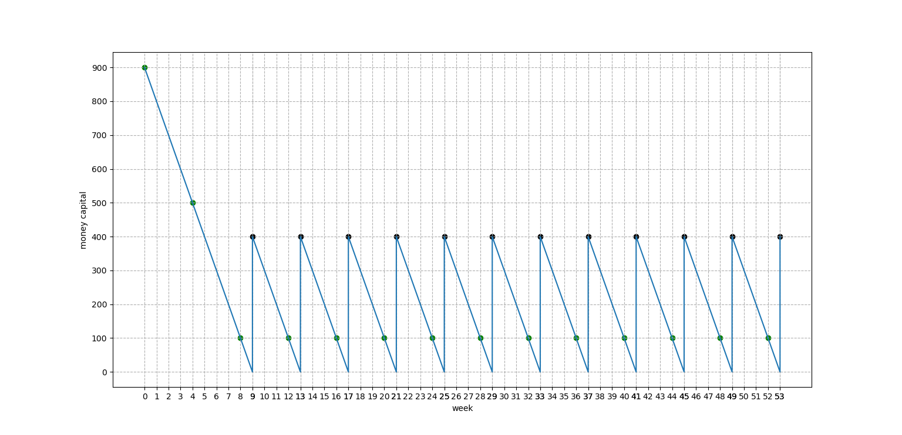

# Python与《资本论》：预付资本填充流通时间的若干特殊实例及其程序化

马克思为了研究下述问题，即流通时间被更大的预付资本所填充从而实现生产的连续性，以及这种填充在周转次数、资本游离等方面之作用，专门就劳动期间与流通期间的大小关系，而划分出三种比较典型的情况：即等于、大于、小于。

马克思统一了一些参数，以便互相比较和参照。比如，周转期间被统一为9周。那么，如果劳动期间与流通期间相等，则二者就不能在完整的周数内实现自己的过程。

（补充一下。我为此前的实例而设计的代码，一开始完全不能用，后来又从回收站找回来，继续研究设计，终于实现了以下功能：将作为整数的周数当作索引，来取出列表中按序保存了的货币资本数。这个程序最初不是这样设计的，但这样设计之后，就不支持浮点数了。后来，不得不回归到更早时的那种看起来更复杂的算法，以支持作为浮点数的周数。现在，周数哪怕不是整数，程序也可以正常运行。懂编程的人，应该能明白这样的好处。）

但马克思明明白白指出：

> 这种情况虽然实际上只是偶然的例外，但是必须作为研究的出发点，因为在这里关系表现得最简单、最明了。

就是说，马克思安排自己的叙述的时候，是从逻辑上是否合理的角度，来作出相应的取舍和设计。哪怕某种情况不存在，或只是偶然的例外情况，可是由于它在逻辑上是比较简单的，便于理解的，特别是便于理解更复杂东西的，那么，依然可以保留并放到合适的逻辑环节上。这又是我所谓**环节式上升法**的一个鲜明实例。

马克思在计算资本的循环运动时，区分了劳动期间和周转期间。这样做，目的是得到（1）作为总体的一个预付资本之劳动期间数目和（2）总资本之周转次数。计算方式不同，则计算结果有差别。

在第一种抽象的运动方式上，资本I和资本II的劳动期间和周转期间并不互相交叉，但在此后的两种运动方式上，皆存在互相交叉，而且亦存在资本游离。（有误。当流通期间是劳动期间的整数倍时，情况比较特殊。）

在第三种情况即劳动期间小于流通期间之下，马克思所举的最后一个实例，十分复杂，连马克思自己都不愿意将其全部的运动方式都列在表内。（或者被恩格斯删掉了？）

不过借助于现代的编程技术，我们可以比较方便地自动计算相关数据并画出相应的运动曲线。

其他的一些可视化，我就不在这里展示了。

不过，由于没有形象的展示方式，他的一些表述会令读者比较困惑。比如他关于经过了多少劳动期间或周转期间的一些表述，特别是将这二者放在一起表述的时候，就容易使人混淆。

借助我的程序，可以方便地从图形上看出来预付资本不同部分的运动方式。参照马克思的文本描述，理解起来十分方便。研究政治经济学相应问题的朋友，可以参考我的这个编程成果。  

目前，我进一步实现了这个特殊的、复杂的需求：流通中预付资本用完了的那个期末，与资本回流的那个期初，在横坐标上是一致的。

等到程序完善到一定程度，我再把源代码放出来吧。

再生产甘特图：

货币资本量图：
