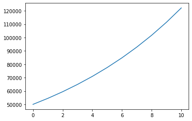

# 马克思经济学与Python：再生产模型及固定资本的价值增殖表象和庸俗经济学的卑劣性

## 再生产的基本逻辑

生产从其整个过程来看，不是一次的生产，而应该表现为再生产。马克思经济学所说的再生产，要扩大自身的规模，是靠着剩余价值的再生产和再投入。

某次的生产过程中，劳动者靠自己的劳动生产出了资本家的剩余价值。剩余价值中的一部分被资本家占有为个人收入，而另一部分被当作扩大再生产的资本来使用。这样使用的时候，这部分剩余价值要按一定比例再投入在不变资本和可变资本之上。从而开启新的一圈生产过程。

## 基本的参数和函数

我们设定，剩余价值率参数为`surplus_value_rate`；剩余价值率再投入到生产过程中的比例为`surplus_value_rate_reinvest`，那么，资本家作为个人收入占有的剩余价值在毛剩余价值中的比例就=`1 - surplus_value_rate_reinvest`；剩余价值再投资到可变资本上的比例为`rate_reinvest_variable`，再投资到不变资本上的比例则为`1 - rate_reinvest_variable`。

在考察这种再生产时，我们可以货币资本循环为一种典型形式，来开始这个过程。

我们设定，期初的不变资本、可变资本、剩余价值的参数分别为`capital_constant`、`capital_variable`、`surplus_value`。在期初，剩余价值率的值设为`0`，这不是说，预付的货币资本中没有上一次生产过程中创造的剩余价值，而是说，在本次货币资本循环中，上一次的剩余价值在经济地位上是作为预付资本本身的一部分。

货币资本周转次数的参数是`production_period`。

为了优化程序，设计了若干函数，比如总资本函数`get_capital_total`，剩余价值函数`get_surplus_value`，剩余价值再投资函数`get_reinvest_capital`。

总资本函数，获取函数运行时的总资本量，包括不变资本、可变资本和剩余价值。

剩余价值函数，根据可变资本量和剩余价值率，计算剩余价值之量。

剩余价值再投资函数，根据预期再投资的剩余价值的量，以及特定资本如可变资本或不变资本的再投资率，来计算再投入到特定资本上的剩余价值之量。

## 再生产作为算法上的循环

在命令式编程语言比如Python中，我们可用for循环来模拟再生产的持续过程。在这里比如说作为预付资本的货币资本周转3次。

每次循环时，先打印该次周转的序号。

再计算期初的总资本量。

模拟剩余价值的生产结果，得到毛剩余价值率。之所以说是毛剩余价值率，是因为此后这里面的一部分要被资本家占有，作为其个人收入。这部分不进入模型中的再生产过程。

毛剩余价值率与期初总资本量的比例，即为利润率。

下面，我们特意设计实现了一个特殊的需求，即固定资本的价值量上所分占的剩余价值量。因为从资本主义生产的表象上看，是全部的预付资本生产了增加的那部分价值。固定资本所分占的新价值，取决于新价值的总量，以及固定资本占总预付资本的比例。

从而，由固定资本所分占的剩余价值量与固定资本本身的比例，得到固定资本上的资本量的价值增殖率。

在这个过程中，可以顺便算出资本家的个人收入。那就是毛剩余价值率与其中作为资本家个人收入的比例之积。这个比例也等于百分之百减去剩余价值再投资之百分比。从这里也可以看到，资本家的个人收入会阻碍资本增殖。对于勤劳、聪明的资本家而言，这当然是个有害的结论。

毛剩余价值减去资本家从其中分掉的个人收入，得到预期再投资的剩余价值量。

这个时候，可以再算一下总资本量。这个总资本量亦是下一次资本循环期初的预付资本量。

为了合理地再生产，预期再投资的剩余价值必须按一定比例，在固定资本和可变资本之间分配。这样分配在特定资本上的新投资的价值量，加上这个特定资本原本的价值量（假定这些价值量可以完善地实现资本循环，就是说，在价值和使用价值上都能合理地实现相应的需要），就是下一次资本循环中相应特定资本的期初量。

这一次资本循环的结果，就是下一次资本循环的前提。循环不断进行，直到完成所设定的周转次数。

## 对程序的一些说明

该份代码中，许多参数可自行调整。

比如剩余价值再投资比例`surplus_value_rate_reinvest`可以改动，当它是0时，就是简单再生产。

可以观察到剩余价值率与利润率之间是有差别的。

固定资本在且只在这个周转期间能正常使用，并且不考虑补偿和维护等因素。

通过模拟计算所得的一些数据，还可以将这个周转过程可视化。比如可得总资本量的增长曲线如下：

从运算结果中还可以看出别的一些东西，这就由读者自行操作吧。

## 庸俗经济学作为资产阶级御用学说的卑劣性

经济学表象以及庸俗经济学，表示全部预付资本都能生产新价值。这样就导致了很多混乱的东西。

比如庸俗经济学想计算固定资本上投入的价值量所生产的新价值。庸俗经济学的固定资本（或劳动资料上的预付资本云云）的折现率，就是这样愚蠢的产物，而且还混淆了利润率和折现率等等，试图用更复杂、更有拜物教性质的贴现，来说明投资所需要的最低限度的利润率。

从庸俗经济学之强调劳动资料，一些读者可以明白，这是他们故意制造的暗示和假象。

一些古典经济学乃至马克思经济学，强调了劳动价值论，认为劳动或者说劳动力是价值的真正源泉。这种比较科学的理论，已经严重损害了资产阶级的切身利益。所以，资产阶级就需要豢养一些听话的经济学家，来对抗劳动价值论。

为了抹杀劳动者在创造价值特别是剩余价值上的作用，就要刻意避开劳动价值论，比如强调是全部的预付资本创造价值，而不是劳动者创造价值。

在固定资本云云的贴现问题上，这个倾向就十分明显。因为不变资本和可变资本，或者说生产资料和劳动力上投入的资本，都需要预付资本投入，在这个片面的性质上面没有任何区别。但庸俗经济学故意只拿出固定资本，来讨论价值增殖，而将付给工人的预付资本当作单纯的成本，以试图规避劳动者创造价值的能动作用，并且将价值增殖神秘化，似乎死的东西比如机器也能创造价值。

从我们这里的分析，应该可以懂得：从根本上讲，庸俗经济学是卑劣的意识形态话术，它的最核心的侧重点不是研究经济关系，而是尽可能掩盖资本主义的内在矛盾。

混乱是它的性质，也是它的目的。诚恳地研究经济关系，反而是它所不愿意的。
