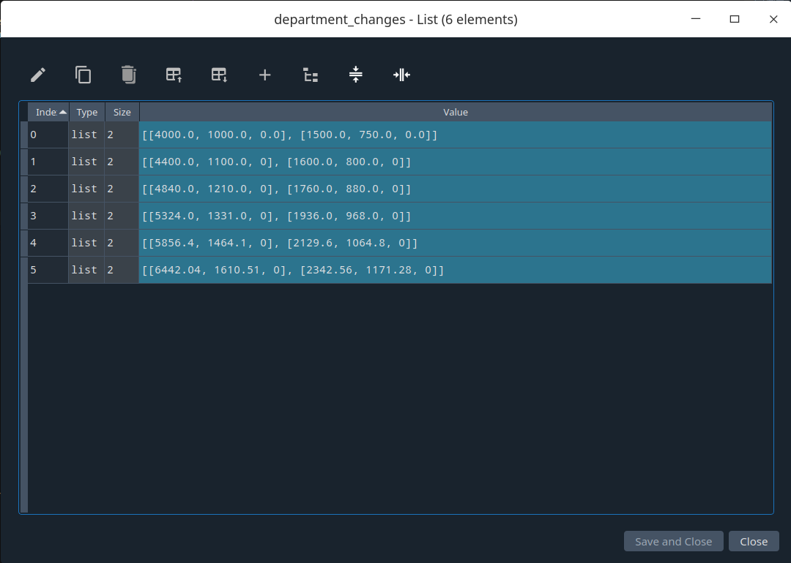
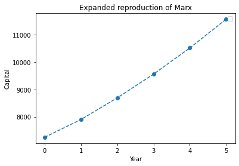
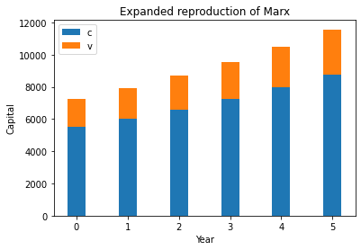
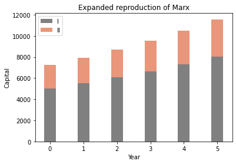

# 马克思两个部类下的简单再生产和扩大再生产模型及其程序化和自动化

马克思在《资本论》第二卷第三篇，依据不变资本、可变资本、剩余价值之区分，特别是生产资料和消费资料之区分，提出了两个部类下的简单再生产和扩大再生产模型。

# 两个部类下的简单再生产程序模型

两个部类下的简单再生产模型的一个关键因素是一个恒等式：$Ⅰv + Ⅰm = Ⅱc.$

这个恒等式的意义是，在简单再生产条件下：

1. 第Ⅰ部类（生产资料部类）之不变资本部分，在该部类之内互相交换，得以实现；

2. 第Ⅰ部类（生产资料部类）之可变资本部分和剩余价值部分，需要从现有的生产资料形式，转换成消费资料形式，因而不能在该部类之内互相交换而得以实现，而是需要同第Ⅱ部类（消费资料部类）相交换。

3. 第Ⅱ部类（消费资料部类）之不变资本部分，需要从现有的消费资料形式，转换成生产资料形式，因而不能在该部类之内互相交换而得以实现，而是需要同第Ⅰ部类（消费资料部类）相交换。

4. 第Ⅱ部类（消费资料部类）之可变资本部分和剩余价值部分，在该部类之该部分之内互相交换，得以实现。

5. 因此，第Ⅰ部类（生产资料部类）之可变资本部分和剩余价值部分，需要同第Ⅱ部类（消费资料部类）之不变资本部分，互相交换，互相实现对方。

首先，我们用Python设计、实现马克思两个部类下的简单再生产之程序模型。

代码如下：

```
```

运行结果如下：

```
Ⅰ: {'c': 4000.0, 'v': 1000.0, 'm': 1000.0}
Ⅱ: {'c': 2000.0, 'v': 500.0, 'm': 500.0}
Ⅰv + Ⅰm = Ⅱc

calculating: {'c': 4000.0, 'v': 1000.0, 'm': 1000.0}
calculating: {'c': 2000.0, 'v': 500.0, 'm': 500.0}
total value: 9000.00
calculating: {'c': 4000.0, 'v': 1000.0, 'm': 1000.0}
total_dept: 6000.00
calculating: {'c': 2000.0, 'v': 500.0, 'm': 500.0}
total_dept: 3000.00
total c: 6000.00
total v: 1500.00
total m: 1500.00
```

我们给出两个部类的相应数据。这些数据以字典这种数据类型保存。c、v、m分别代表不变资本、可变资本、剩余价值。

然后，我们验证**简单再生产下两部类间交换之恒等式**，$Ⅰv + Ⅰm = Ⅱc.$如果相等，就打印相应的恒等式。

随后，我们对两大部类的诸数据，进行三种不同的统计：

1. 计算两个部类的总产品价值；

2. 分别计算两个部类的总产品价值；

3. 按不变资本、可变资本、剩余价值统计总产品价值，不分部类。

统计的方式比较简单，请自行阅读相应代码。

# 两个部类下的扩大再生产程序模型

现在，在马克思两个部类下的简单再生产之程序模型的基础上，设计、实现马克思两个部类下的扩大再生产之程序模型。这是一个杰出的创举，原素材可参阅《资本论》第二卷第二十一章第Ⅲ节第1小节。

代码如下：

```
```

运行结果如下（不包含生成的图形）：

```
Expanded reproduction of Marx.

Year 1:
I: {'c': 4000.0, 'v': 1000.0, 'm': 0.0}
II: {'c': 1500.0, 'v': 750.0, 'm': 0.0}
------------ produce ------------
I: {'c': 4000.0, 'v': 1000.0, 'm': 1000.0}
II: {'c': 1500.0, 'v': 750.0, 'm': 750.0}
------------ accumulating ------------
acc_m_1: 500.00
add_to_c_1: 400.00
add_to_v_1: 100.00
add_to_c_2: 100.00
add_to_v_2: 50.00
------------ expanded ------------
I: {'c': 4400.0, 'v': 1100.0, 'm': 500.0}
II: {'c': 1600.0, 'v': 800.0, 'm': 600.0}
------------ calc all ------------
total value: 7900.00
------------ calc dept ------------
calculating: {'c': 4400.0, 'v': 1100.0, 'm': 0}
total_dept: 5500.00
------------ calc dept ------------
calculating: {'c': 1600.0, 'v': 800.0, 'm': 0}
total_dept: 2400.00
------------ calc cvm ------------
total c: 6000.00
total v: 1900.00
total m: 0.00

Year 2:
I: {'c': 4400.0, 'v': 1100.0, 'm': 0}
II: {'c': 1600.0, 'v': 800.0, 'm': 0}
------------ produce ------------
I: {'c': 4400.0, 'v': 1100.0, 'm': 1100.0}
II: {'c': 1600.0, 'v': 800.0, 'm': 800.0}
------------ accumulating ------------
acc_m_1: 550.00
add_to_c_1: 440.00
add_to_v_1: 110.00
add_to_c_2: 160.00
add_to_v_2: 80.00
------------ expanded ------------
I: {'c': 4840.0, 'v': 1210.0, 'm': 550.0}
II: {'c': 1760.0, 'v': 880.0, 'm': 560.0}
------------ calc all ------------
total value: 8690.00
------------ calc dept ------------
calculating: {'c': 4840.0, 'v': 1210.0, 'm': 0}
total_dept: 6050.00
------------ calc dept ------------
calculating: {'c': 1760.0, 'v': 880.0, 'm': 0}
total_dept: 2640.00
------------ calc cvm ------------
total c: 6600.00
total v: 2090.00
total m: 0.00

Year 3:
I: {'c': 4840.0, 'v': 1210.0, 'm': 0}
II: {'c': 1760.0, 'v': 880.0, 'm': 0}
------------ produce ------------
I: {'c': 4840.0, 'v': 1210.0, 'm': 1210.0}
II: {'c': 1760.0, 'v': 880.0, 'm': 880.0}
------------ accumulating ------------
acc_m_1: 605.00
add_to_c_1: 484.00
add_to_v_1: 121.00
add_to_c_2: 176.00
add_to_v_2: 88.00
------------ expanded ------------
I: {'c': 5324.0, 'v': 1331.0, 'm': 605.0}
II: {'c': 1936.0, 'v': 968.0, 'm': 616.0}
------------ calc all ------------
total value: 9559.00
------------ calc dept ------------
calculating: {'c': 5324.0, 'v': 1331.0, 'm': 0}
total_dept: 6655.00
------------ calc dept ------------
calculating: {'c': 1936.0, 'v': 968.0, 'm': 0}
total_dept: 2904.00
------------ calc cvm ------------
total c: 7260.00
total v: 2299.00
total m: 0.00

Year 4:
I: {'c': 5324.0, 'v': 1331.0, 'm': 0}
II: {'c': 1936.0, 'v': 968.0, 'm': 0}
------------ produce ------------
I: {'c': 5324.0, 'v': 1331.0, 'm': 1331.0}
II: {'c': 1936.0, 'v': 968.0, 'm': 968.0}
------------ accumulating ------------
acc_m_1: 665.50
add_to_c_1: 532.40
add_to_v_1: 133.10
add_to_c_2: 193.60
add_to_v_2: 96.80
------------ expanded ------------
I: {'c': 5856.4, 'v': 1464.1, 'm': 665.5}
II: {'c': 2129.6, 'v': 1064.8, 'm': 677.6000000000001}
------------ calc all ------------
total value: 10514.90
------------ calc dept ------------
calculating: {'c': 5856.4, 'v': 1464.1, 'm': 0}
total_dept: 7320.50
------------ calc dept ------------
calculating: {'c': 2129.6, 'v': 1064.8, 'm': 0}
total_dept: 3194.40
------------ calc cvm ------------
total c: 7986.00
total v: 2528.90
total m: 0.00

Year 5:
I: {'c': 5856.4, 'v': 1464.1, 'm': 0}
II: {'c': 2129.6, 'v': 1064.8, 'm': 0}
------------ produce ------------
I: {'c': 5856.4, 'v': 1464.1, 'm': 1464.1}
II: {'c': 2129.6, 'v': 1064.8, 'm': 1064.8}
------------ accumulating ------------
acc_m_1: 732.05
add_to_c_1: 585.64
add_to_v_1: 146.41
add_to_c_2: 212.96
add_to_v_2: 106.48
------------ expanded ------------
I: {'c': 6442.04, 'v': 1610.51, 'm': 732.05}
II: {'c': 2342.56, 'v': 1171.28, 'm': 745.3599999999999}
------------ calc all ------------
total value: 11566.39
------------ calc dept ------------
calculating: {'c': 6442.04, 'v': 1610.51, 'm': 0}
total_dept: 8052.55
------------ calc dept ------------
calculating: {'c': 2342.56, 'v': 1171.28, 'm': 0}
total_dept: 3513.84
------------ calc cvm ------------
total c: 8784.60
total v: 2781.79
total m: 0.00

Year 6:
I: {'c': 6442.04, 'v': 1610.51, 'm': 0}
II: {'c': 2342.56, 'v': 1171.28, 'm': 0}
------------ produce ------------
I: {'c': 6442.04, 'v': 1610.51, 'm': 1610.51}
II: {'c': 2342.56, 'v': 1171.28, 'm': 1171.28}
------------ accumulating ------------
acc_m_1: 805.25
add_to_c_1: 644.20
add_to_v_1: 161.05
add_to_c_2: 234.26
add_to_v_2: 117.13
------------ expanded ------------
I: {'c': 7086.244, 'v': 1771.561, 'm': 805.255}
II: {'c': 2576.816, 'v': 1288.408, 'm': 819.8960000000002}
------------ calc all ------------
total value: 12723.03
------------ calc dept ------------
calculating: {'c': 7086.244, 'v': 1771.561, 'm': 0}
total_dept: 8857.81
------------ calc dept ------------
calculating: {'c': 2576.816, 'v': 1288.408, 'm': 0}
total_dept: 3865.22
------------ calc cvm ------------
total c: 9663.06
total v: 3059.97
total m: 0.00
```

为了优化代码逻辑，这份代码设计了一些函数。我们按照程序执行的逻辑来叙述这份代码，在涉及相关函数时，再解释函数的功能。

我们仍然像简单再生产程序模型那样，给出两个部类的数据。在代码中，有两份数据，分别对应马克思给出的两个实例。

现在，计算第Ⅰ部类积累不变资本和可变资本的比例，即`add_c_rate_1`和`add_v_rate_1`。计算前者的方法是，相应不变资本除以不变资本和可变资本之和。计算后者的方法是，相应可变资本除以不变资本和可变资本之和。注意，积累的来源是该部类的剩余价值部分，积累的价值要按照原有的相应比例，分配到不变资本或可变资本上。因此，这里有一个潜在的前提，即模型中的资本主义积累不会改变不变资本与可变资本的既有比例。这两个比例，后面会用到。

还要计算第Ⅱ部类可变资本与不变资本之比`v_c_rate_2`。这个值用于根据追加的第Ⅱ部类之不变资本之数量，来追加该部类之可变资本。后面会用到。

列表`department_changes`用来保存程序中出现的两个部类的诸数据，这些数据会改变。

然后，我们设定要积累多少年，放入变量`year`。如果这个变量的值是6，for循环就会执行6次，我们可以得到初始的两个部类的数据，以及此后5个年度的积累后的数据。

进入for循环后，把该次循环开始时两个部类中的数据，保存到列表`department_changes`中。这样，会形成一个三级的嵌套列表，最内部的列表分别是两个部类各自的数据形成的列表，然后是这样的一对列表形成一个嵌套列表，然后是这样的列表按照年度再并列起来。形式如下：




下面是生产函数`produce`，这个函数根据特定部类中的可变资本之数额和剩余价值率，来生产出剩余价值。

两个部类都生产出剩余价值之后，可以打印出结果，供阅读和确认。

接下来，就是最关键的积累函数。积累所得的两个部类的数据结果会代替这两个部类原有的数据。

积累完成后，我们将两个部类的剩下的剩余价值归〇。意思是，这部分剩余价值被资本家用于个人消费。

现在，再来做各种统计。这些统计，我们在简单再生产模型中已经见过了，这里是设计成了函数。不再赘述。

# 对积累函数的专门分析

积累函数`accumulate`是这份代码的关键，现在专门分析这个函数。

在这个模型中，假设每次第Ⅰ部类积累一半的剩余价值。

现在，将这个积累过来的剩余价值，按相应的比例，分配给该部类的不变资本和可变资本之部分。

然后，按这样的分配方式，进行分配。注意，第Ⅰ部类的剩余价值要减去积累了的这个部分。

现在开始计算第Ⅱ部类之不变资本需要积累多少。相应的变量是`add_to_c_2`。计算方式是，用第Ⅰ部类现在的可变资本和剩余价值的数量之和，减去当前第Ⅱ部类不变资本之数量。这样做，是为了从两部类之间交换的不相等，转变为相等。然后进行积累。

这样一来，第Ⅱ部类之不变资本得到了合适的积累，相应地，该部类之可变资本，也要根据这个不变资本积累的数量，按特定的比例，积累自己。相应的变量是`add_to_v_2`。然后进行积累。

相应地，第Ⅱ部类之剩余价值的量，就要减去该部类中不变资本和可变资本所积累了的量。

可以将两个部类的数据打印出来，观察相关数据。

这个for循环能进行，积累也就能进行，除非到达这个循环之边界条件。

现在，我们需要的两个部类之变化了的数据，都保存在了`department_changes`里。

# 三种可视化之方法

接下来，我们用三种方法，统计并可视化`department_changes`里的数据。

第一种方法是，按每一年度，将两个部类的资本，包括不变资本和可变资本，统计在一起。这样，就可以逐年展示总资本之量。可据此绘制图形如下，这是折线图：




第二种方法是，按每一年度，按不变资本和可变资本之区别，统计两个部类。就是说，每一年度中的资本要区分为不变资本和可变资本。我们可用堆叠柱状图来展示这些数据。图形如下：




在这个图形中，蓝色代表不变资本，橙色代表可变资本，每一个柱代表一个年度。

第三种方法是，按每一年度，按两个部类之区别，进行统计。就是说，每一年度中的资本要区分为第Ⅰ部类和第Ⅱ部类。我们可用堆叠柱状图来展示这些数据。图形如下：



注意，横坐标上的数值有特殊的含义。比如，0指第0年末、第1年初，也就是通常意义上的最初状态。1指第1年末、第2年初。诸如此类。

# 总结

借助马克思两个部类下的简单再生产程序模型，我们可以自动验证简单再生产所必需的恒等式是否满足，并可统计一些数据。

借助马克思两个部类下的扩大再生产程序模型，我们可以自动完成相应模型下的积累。具体的计算过程，完全由计算机来实现。不仅如此，我们还可将积累的过程可视化。

希望这个文档能够帮助读者理解本人设计的两个再生产模型。