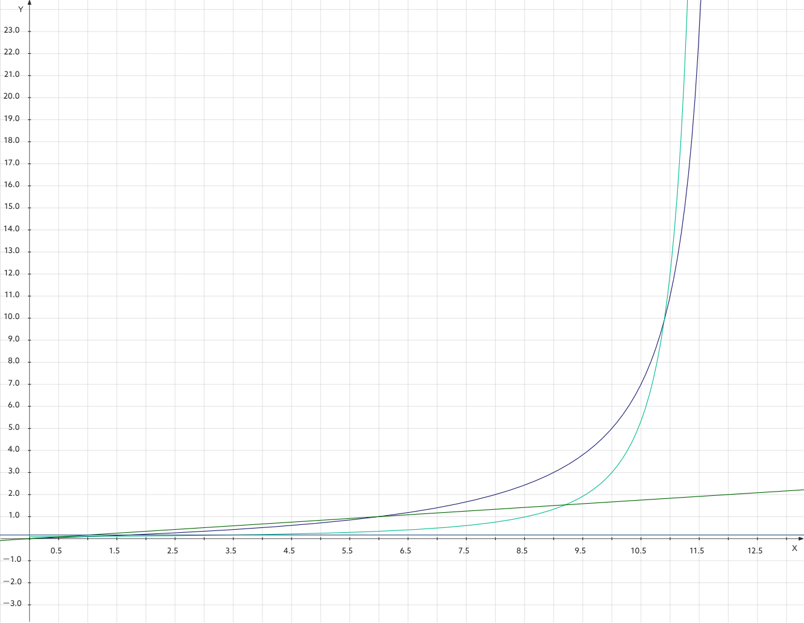

# Python与《资本论》：绝对的与相对的剩余价值及相应的剩余价值率变动

我们研究理论问题的朋友，特别是想要同大家一起携手进步的朋友，也应该注意理论的普及工作。

本人此前已经用高等数学、Python编程等方式，实现了许多问题的数学化、程序化或可视化，比如资本周转的欧拉螺线模型（我近期比较高兴的一个成果），剩余价值率对可变资本的相对替代和绝对替代模型，预付资本填充流通期间问题，等等。

但是，这些问题，普通读者经常是接触不到，而且其中一些理论又往往比较深奥，比较复杂，因而对普通读者来说，很难得到**切实的收获**。

那么此次，我就分享一下大家都比较熟悉的一些问题，即绝对剩余价值和相对剩余价值的剥削问题，期待更广泛的读者能从这里的分析中，实现一定的共鸣，得到一定的收获。

---

工人为了维持自己及其家庭等的通常生活，对于一个工作日来说，其中必须有一段时间是为了自己而生产。

超出这个必要的劳动时间而进行的劳动时间，生产出来的价值即是剩余价值。这种剩余价值是资本主义生产的最初基础。

而$剩余价值率 = \frac{剩余价值}{可变资本} = \frac{剩余劳动时间}{必要劳动时间}.$

在以上的理论基础上，可以引出“**绝对剩余价值**”的概念：在必要劳动时间不变的情况下，增大剩余劳动时间。这样做可以提高剩余价值率。实现这个方式的途径也比较简单，就是单纯地延长劳动者的劳动时间。

但是，增加剩余价值率的方式不只这一种。另一种方式是生产“**相对剩余价值**”，就是说，在工作时长或者说工作日长度不变的情况下，减少必要劳动时间。实现这个方式的途径是，提高生产力，进一步说，提高生产技术等等。

不难得出以下的剩余价值率公式：

就绝对剩余价值率来说：$$m' = \frac{m}{v}.$$其中可变资本或者说必要劳动时间v是常量，剩余价值或者说剩余劳动时间m是自变量，剩余价值率或者说剩余劳动时间率m'是因变量。

就相对剩余价值率来说：$$m' = \frac{m}{wh - m}.$$其中wh指工作时长云云，是常量，剩余价值或者说剩余劳动时间m是自变量，剩余价值率或者说剩余劳动时间率m'是因变量。

分别对这二种剩余价值率公式求导，可得：

绝对剩余价值率的导函数：$f'(m) = \frac{1}{v}$

相对剩余价值率的导函数：$g'(m) = \frac{1 \times (wh - m) - m \times (-1)}{(wh - m)^2} = \frac{wh}{(wh - m)^2}$

当v为6、wh为12时，可得二种剩余价值率的函数及导函数的图像如下（暂且忽略自变量的取值范围）：

此外，还可以就这二种剥削剩余价值的方式，设计相应的算法，用Python实现如下：

剥削绝对剩余价值：

![[work_day_absolute.py]]

剥削相对剩余价值：

![[work_day_relative.py]]

我们可以观察到，在整个24小时的自然日中，必要劳动时间、剩余劳动时间、其他时间的量和比这二方面的变动。还可以观察到，在这二种抽象出来的剥削方式下，剩余价值率随剩余劳动时间的变化而如何变化。

从相关剩余价值率的导函数图像，易知，在剥削相对剩余价值时，剩余价值率随剩余劳动时间的变化幅度经常更大。

从经济现实来说，

1. 加重剥削绝对剩余价值时，侵占劳动者权益的性质十分明显，容易激起劳动者的不满与反抗。并且，由于一些外在的明显限制，比如一天的自然时长只有24小时，劳动者必须有一定的休息时间等等，这种剥削方式在增加剩余价值的量和率方面，比较有限。但是，在技术这个因素大体不变的情况下，延长劳动者的工作时间反而是单个资本家，特别是不掌握先进技术的资本家，优先考虑的方式。

2. 相对地，加重剥削相对剩余价值时，由于劳动者的必要劳动时间随生产力的发展而减少的程度不容易被直观感受到，所以不容易激起不满与反抗。并且，在相应的函数关系上，相对剩余价值率的变动幅度也经常大得多。但是，这就要求大力提高生产力，因而提高生产方面的若干技术。短期内，要提高技术水平是比较困难的，并且需要大量的先期投资等等，所以，在短期内，这样的方式反倒不明显。

总而言之，我们更容易注意到剥削绝对剩余价值的事情。一方面是因为，这样的剥削（强迫加班并且不给加班费等等）太明显，太容易被人察觉，另一方面是因为，在经济的短期运动中，技术的变化不太明显，就是说，技术的变化与作用要在长期中，或者在突然的明显进步等等中，才能更显著地被察觉到。

---

回应：

如果要读懂这里的理论分析，主要需要明白以下的东西：

- 相对剩余价值与绝对剩余价值的基本定义、生产出来的方式。

- 应该注意，相对剩余价值公式$m' = \frac{m}{wh - m}$里的分母$wh - m$指必要劳动时间。而在工作日长度是常量的这类情况下，它是剩余劳动时间的函数。意思说，分母所代表的必要劳动时间随剩余劳动时间的变动而变动。

- 求导的基本知识，比如这里比较突出的是分数的求导。

这里的数学比较简单，其中比较复杂的是相对剩余价值的函数及其导函数。从高等数学本身的复杂程度来说，其实不难。一般来说，了解微积分的基本常识就能比较顺畅地看懂。

另外，我们在这里不是只沉迷于数学游戏，只满足于数学形式，而是也要指出数学形式背后的经济现实。因此我们才会强调在经济现实中关于此二种剩余价值的一些具体情况。
