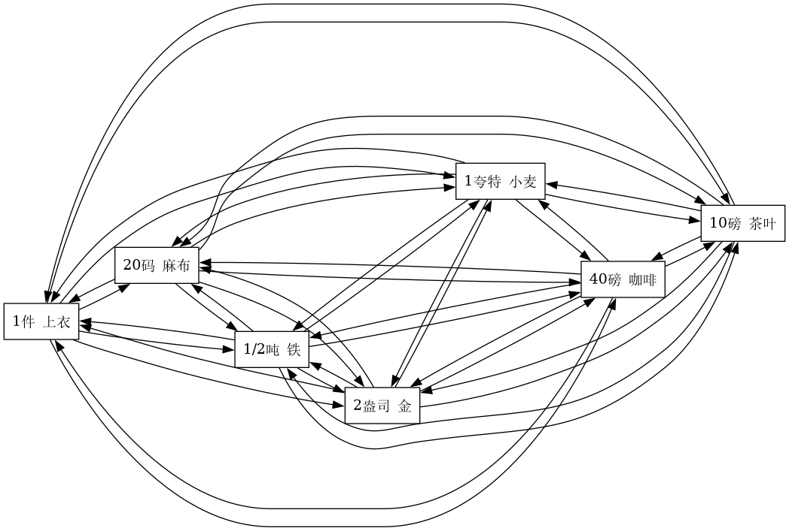

# Rust：价值形式理论的自动生成和可视化项目

## 项目概述

[本项目](https://github.com/Wangsutan/Kapital/tree/master/资本的生产过程/价值形式理论/价值形式)将价值形式理论所需的源数据，保存在 `.toml` 格式的配置文件中，并通过这些文件生成《资本论》第一卷简单生产过程环节上的价值形式理论的有向图，以此更形象地展现和理解马克思价值形式理论。在研究过程中还发现扩大的价值形式的新形象。





本项目分为两个主要部分：

1. **gen_total_rs**：负责从扩大的价值形式相关配置文件 `total.toml` 中提取商品信息，并生成一个新的文件 `total_true.toml`，扩大了扩大的价值形式中的交换关系。马克思本人只是展现了一种相对价值物对多种等价物的交换关系，而没有展现后者作为相对价值物时相应的交换关系。经过该子项目的自动**扩展**，**扩大**的价值形式的更完整面貌得以体现出现。
2. **gen_graphviz**：负责读取 `.toml` 配置文件，生成对应的 `.dot` 文件，并借助 Graphviz 工具生成 `.png` 图像，直观展示商品之间的交换关系。这是本项目最核心的代码。

## 项目结构

- **gen_total_rs**：Rust 子项目，负责处理 `total.toml` 文件并生成 `total_true.toml`。
- **gen_graphviz**：Rust 子项目，负责读取 `.toml` 文件并生成 `.dot` 文件和 `.png` 图像。
- **pic_demo**：存放生成的 `.png` 图像样例。
- **.toml 文件**：存放原始数据，包含商品名称和交换比例等信息。
- **.dot 文件**：Graphviz 的 DOT 语言描述文件，用于生成图像。
- **.png 文件**：生成的图像文件，展示商品之间的交换关系。

## 使用方法

1. **配置 `.toml` 文件**：在该项目根目录下配置 `.toml` 文件，定义商品名称和交换比例。`total_true.toml`无需手动配置，应该自动生成。
2. **运行 gen_total_rs**：在该子项目根目录下运行 `cargo run`，以运行该项目，生成 `total_true.toml` 文件。
3. **运行 gen_graphviz**：在该子项目根目录下运行 `cargo run`，以运行该项目，生成 `.dot` 文件和 `.png` 图像。
4. **查看结果**：在该项目根目录下查看生成的 `.dot` 和 `.png` 图像。`pic_demo` 中的图片是本项目已经生成的样例图片。

## 依赖

本项目在 Manjaro 平台编译成功。我的系统信息如下：

```txt
macchina

        a8888b.           Host        -  wst@wst-h310ms220
       d888888b.          Machine     -  Gigabyte Technology Co., Ltd. Default string H310M S2 2.0
       8P"YP"Y88          Kernel      -  6.13.5-2-MANJARO
       8|o||o|88          Distro      -  Manjaro Linux
       8'    .88          DE          -  KDE
       8`._.' Y8.         WM          -  KWin (X11)
      d/      `8b.        Packages    -  1539 (pacman), 2 (cargo)
     dP        Y8b.       Shell       -  zsh
    d8:       ::88b.      Terminal    -  alacritty
   d8"         'Y88b      Resolution  -  1024x768
  :8P           :888      Uptime      -  7d 1h 51m
   8a.         _a88P      CPU         -  Intel® Core™ i3-8100 CPU @ 3.60GHz (4)
 ._/"Yaa     .| 88P|      CPU Load    -  5%
 \    YP"    `|     `.    Memory      -  5.2 GB / 16.3 GB
 /     \.___.d|    .'     GPU         -  GM107M [GeForce GTX 960M]
 `--..__)     `._.'

 ```

- **Rust**：项目使用 Rust 编程语言编写。版本为 `rustc 1.86.0-nightly (6171d944a 2025-02-10)`。
- **Graphviz**：用于生成 `.png` 图像的工具。版本为 `12.2.1 (0)`。

## 结论

本项目通过 Rust 语言，自动化处理包含价值形式相关数据的 `.toml` 文件，生成价值形式理论相关的有向图，帮助用户更直观地理解该理论，并且构成了新的发展和突破。
