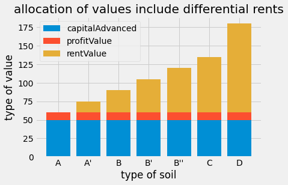

该代码根据已知的一些数据，比如一般资本投资，小麦市场价格，每种土地上的投资额和小麦产量，来计算其他数据，如初始利润值，每种土地上的产值、利润率、利润价值额、利润实物额、地租价值额、地租实物额和个别生产价格云云。

这里得到的数据，可以制成表格[[differentialRent\_2ndConditions.xlsx]]。

注意，这个表格对应的是《文集》第7卷第739页的表Ⅱ。

此后，根据这个表格，通过Python代码[[differentialRent_2ndConditions_stacked_bar_chart.py]]，可以绘制预付资本、农业利润、地租的相关堆叠柱状图，见文档[[differentialRent_2ndConditions_stacked_bar_chart]]。

形成的可视化结果如下：

