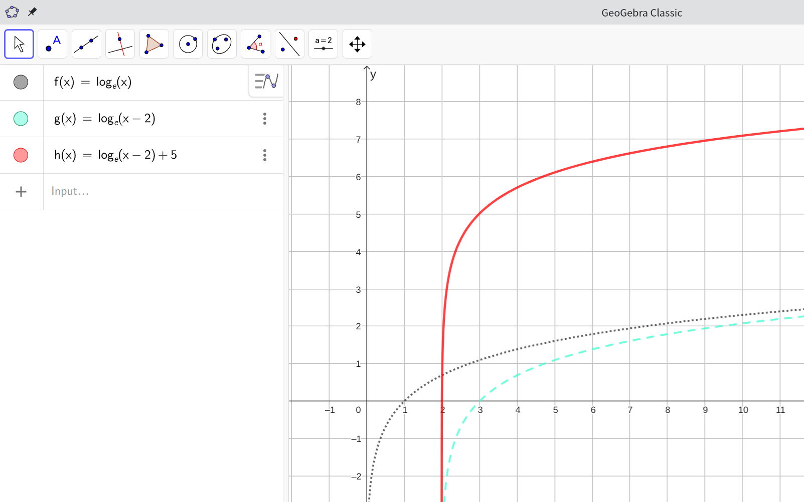

# 如何设计生产力函数

近期，为了研究和发展马克思级差地租相关理论，本人迫切需要设计一种生产力函数，作为一种核心的经济关系，纳入到关于级差地租的通用程序中。

在研究过程中，我发现，数学上的log函数在其底数大于1时，具有单调递增（一阶导为正）、增加速度递减（二阶导为负）以及从某一横坐标上的点开始纵坐标才为正数等优良性质，比较适合用来模拟经济学上的生产力函数。因为，在一定取值范围内，投资只有达到一定最低限额，生产才得以进行，并且投资越大，产出越大，但是边际收益会递减。

![[截图_选择区域_20230831190705.jpg]]

因此，我设计制作了以log函数为核心的一种生产力函数模型。

首先要明确其中的一些参数：

- `base`为底数。
- `left_right_translate`为左右平移量，缩写为`lr`。
- `up_down_translate`为上下平移量，缩写为`ud`。
- `abscissa_flexible`为横坐标伸缩量，缩写为`af`。
- `ordinate_flexible`为纵坐标伸缩量，缩写为`of`。

具体公式如下：

$$of \times \log_{base}{(af \cdot x - lr)} + ud, base > 1, af > 0, of > 0.$$

就是说，横坐标拉伸不叠加到左右平移的影响上。纵坐标拉伸不叠加到上下平移的影响上。

现在，通过GeoGebra软件，我们假设这样一个生产函数：$$f(x)=log(ℯ,x).$$
这个函数在经济学上可以理解为：最低投资为1，只有达到这个最低限度，才会开始出现产出。

把上述函数向右平移2，则可以得到另一个生产函数：$$g(x)=log(ℯ,x-2).$$
这个函数在经济学上可以理解为：最低投资为3，只有达到这个最低限度，才会开始出现产出。

把上述函数向上平移5，则可以得到又一个生产函数：$$h(x)=log(ℯ,x-2)+5.$$
这个函数在经济学上可以理解为：最低投资为3，只有达到这个最低限度，才会开始出现产出，并且最低产出为5。

这些函数的函数图像如下：

对该公式，我们求其成立之条件。

条件有两个：一是$af \cdot x -lr \geq 1.0$；二是$of \times \log_{base} (af \cdot x -lr) + ud > 0.0$。

对条件一，可得：

$$x \geq \frac{1.0 + lr}{af}, af \neq 0.$$

对条件二，可得：

$$\log_{base} (af \cdot x -lr) > -\frac{ud}{of},$$
$$af \cdot x -lr > base^{-\frac{ud}{of}},$$
$$x > \frac{base^{-\frac{ud}{of}} + lr}{af}, base > 1, af \neq 0, of \neq 0.$$

对于其中的参数，总的来说，只需满足以下条件：

- base > 1
- af > 0
- of > 0

有了这样的生产力函数，很容易就能计算所谓的级差地租Ⅱ及其他若干种数值，而不需像马克思那样繁琐。
